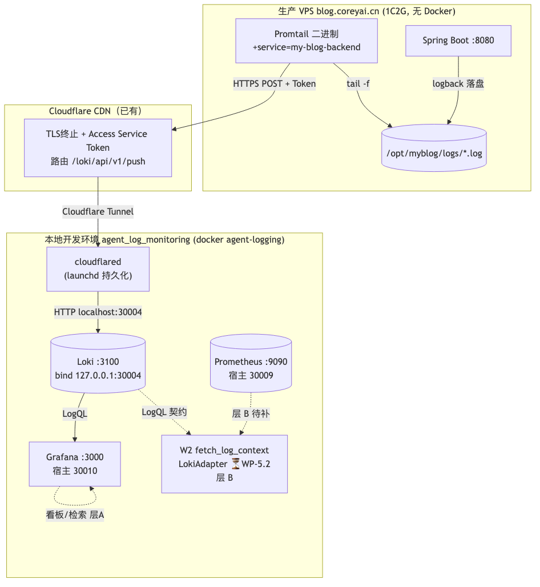

# 博客日志接入 agent_log_monitoring — 部署方案（Deployment Plan）

| 项 | 值 |
|---|---|
| 文档编号 | DESIGN-DEPLOY-BLOG-LOG-2026-07-13 |
| 文档版本 | v1.3（Phase 2 本地验证通过） |
| 日期 | 2026-07-14 |
| 作者 | 钱架构（系统架构师） |
| 状态 | Phase 0-2 已完成；Phase 3-4 待执行（生产部署） |
| 关联文档 | `博客日志接入Loki方案设计.md`（DESIGN-LOKI-2026-07-07 v1.2，设计依据）<br>`05-博客日志接入agent_log_monitoring-接入技术方案.md`（ADR-INTEG-BLOG-LOG-2026-07-12，决策依据）<br>`服务日志体系设计.md`（REQ-LOG-2026-06-18） |

---

## 0. 前置决策（引用 ADR-INTEG-BLOG-LOG-2026-07-12 已定结论）

本部署方案是 05 技术方案的**执行层**，下列决策已锁定，本方案不再讨论：

| # | 决策项 | 结论 | 出处 |
|---|---|---|---|
| D1 | 接入边界 | **层 A 先行**（日志进 Loki + Grafana 检索/看板）；层 B（W2 研判）留 Phase 2 | 05 §2 / §10 |
| D2 | Grafana | **补部署**，端口 `30010`（宿主 `30010→容器 3000`） | 05 §3.① / MEMORY 端口段 |
| D3 | 博客日志 `service` 标签 | `service=my-blog-backend` | 05 §4.2 |
| D4 | 层 B 触发模式 | **拉模式**（博客日志作 W2 研判上下文） | 05 §6 |
| S1 | Loki 端口整改 | 改 `127.0.0.1:30004:3100`（仅本地回路） | 05 §3.② |
| 端口 | Prometheus `30009` / Grafana `30010` | 已分配固化 | MEMORY 端口段 |
| D5 | 验证策略 | **本地 sim 优先**：先在本地 `myblog-sim` 容器跑通整链（`myblog-sim → 本地 Promtail → Loki → Grafana`），验证通过**后再**部署生产 VPS | 本方案 §2.6 / §4 阶段2 |

> 本方案所有端口、标签、链路均以此为准。DESIGN-LOKI（v1.2）中 "Grafana(:3000)" 与 "Loki 0.0.0.0 暴露" 两处与现状不符，**以本方案 + 05 为准**，待后续回填 DESIGN-LOKI。

---

## 1. 部署范围与拓扑

### 1.1 跨环境拓扑

```
┌─────────────────────────────────────────────────────────────────────┐
│  生产 VPS  blog.coreyai.cn (1C2G, 无 Docker)                          │
│                                                                      │
│   Spring Boot(:8080) ──logback 落盘──▶ /opt/myblog/logs/*.log        │
│                                              │ tail -f               │
│                                              ▼                       │
│                                    Promtail(二进制, ~30MB)           │
│                                    +service=my-blog-backend          │
│                                              │ HTTPS POST + Token    │
└──────────────────────────────────────────────┼──────────────────────┘
                                                │
                              Cloudflare CDN（已有）
                              TLS终止 + Access Service Token
                              路由 /loki/api/v1/push
                                                │ Cloudflare Tunnel(加密)
                                                ▼
┌─────────────────────────────────────────────────────────────────────┐
│  本地开发环境  agent_log_monitoring (docker-compose, 网络 agent-logging)│
│                                                                      │
│   cloudflared ──HTTP localhost:30004──▶ Loki(:3100, bind 127.0.0.1)  │
│                                              │ LogQL                  │
│              ┌─────────────────────────────┴──────────┐             │
│              ▼                                         ▼             │
│        Grafana(:3000, 宿主30010)              Prometheus(:9090, 宿主30009) │
│        ├─ 数据源 Loki / Prometheus              (自采集, WP-5.3 补足)   │
│        └─ 博客日志看板                            ▲                     │
│                                                  │ (层 B: LokiAdapter)│
│                                          W2 fetch_log_context ⏳WP-5.2│
└─────────────────────────────────────────────────────────────────────┘
```



> **🔧 验证策略变更（D5）**：上图"生产 VPS"分支为**目标生产形态**。按本方案，正式打通前先在**本地**起一个 `myblog-sim` 容器模拟博客（产出同格式日志），由**本地 Promtail 直连 Loki**（同 docker 网络 `agent-logging`，URL `http://loki:3100`，**无需 cloudflared / Cloudflare Tunnel**）跑通整链。本地验证通过 = 日志契约（标签 `service=my-blog-backend`、regex、traceId、Grafana 看板）全部成立，**之后**才推进"生产 VPS + Tunnel"分支。见 §2.6 与 §4 阶段2。

### 1.2 端口与服务分配

| 服务 | 位置 | 容器端口 | 宿主映射 | 绑定 | 说明 |
|---|---|---|---|---|---|
| Loki | 本地 docker | 3100 | 30004 | **127.0.0.1**（整改后） | 日志存储/查询 |
| Grafana | 本地 docker（**新增**） | 3000 | **30010** | 127.0.0.1 | 可视化/看板 |
| Prometheus | 本地 docker（已有） | 9090 | 30009 | **127.0.0.1**（已整改） | 指标（WP-5.3 补足） |
| cloudflared | 本地（launchd） | — | — | localhost | Tunnel 客户端 |
| Promtail | VPS 二进制 | 9080 | — | localhost | 日志采集 |

> ⚠️ Grafana 与 Loki 同样按项目约定 bind `127.0.0.1`；如需远程访问走 SSH 隧道或 Cloudflare Access，**禁止 `0.0.0.0` 暴露**（与 Prometheus 同类风险，周审查已升级）。

### 1.3 改动影响分析（按改造对象拆分）

本方案对「博客网站」本身**零代码侵入**，改动全部落在运维/部署层与当前系统接收端。下表按改造对象拆分工作量：

| 改造对象 | 代码改动 | 运维/配置改动 | 工作量 | 说明 |
|---|---|---|---|---|
| **博客应用代码**（my-blog Spring Boot） | **0 行** | 0 | 无 | `logback-spring.xml` 早已落盘 + 带 `traceId` + 分级降噪；接入为**旁路采集**（Promtail 读已落盘日志），不侵入应用进程；日志格式已被 Promtail 正则精确匹配，无需为接入改写 |
| **博客 VPS 运维层**（Promtail + Tunnel） | 0 行 | 新增 | 中 | 独立二进制（Promtail ~30MB）+ systemd 服务 + Cloudflare Tunnel；唯一与接入相关的增量 = Promtail `scrape_config` 加 **1 个静态标签** `service=my-blog-backend`（写在 Promtail 配置，不在博客代码） |
| **本地接收端**（cloudflared） | 0 行 | 新增 | 中 | 本地 launchd 持久化跑 `cloudflared`，转发 `localhost:30004`（Loki 整改后仍为本地回路，链路不变） |
| **当前系统侧 — Loki 端口整改**（S1） | 0 行 | 改 1 行 | 小 | `docker-compose.yml` 中 `loki.ports` 由 `30004:3100` 改为 `127.0.0.1:30004:3100` |
| **当前系统侧 — Grafana 新增**（S2/S3） | 0 行 | 新增服务 + provisioning | 中 | 新增 `grafana` 服务（端口 30010）+ 数据源自动配置 + 博客日志看板（provisioning 载入） |
| **当前系统侧 — W2 研判**（层 B，Phase 2） | 有（WP-5.2） | 0 | 大 | `LokiAdapter` 实现 + 查询契约（按 `service`/`traceId`/时间窗）；属系统自身演进，**不在本次部署范围** |
| **本地验证设施 — myblog-sim 容器**（D5，验证优先） | 0 行 | 新增 | 小 | 本地起 `myblog-sim`（模拟博客日志产出）+ `myblog-sim-promtail`（同 B2 配置，仅 `clients.url` 指向 `http://loki:3100`）；**纯本地、不触生产**，验证通过即销毁或保留为回归沙箱 |

**结论**

- **博客网站端改造 = 0 代码、0 回归风险**：接入对博客业务完全无侵入，日志产出端（`logback-spring.xml`）在 DESIGN-LOKI（2026-07-07）之前即已就绪，本次仅"接上管道"。
- **本次部署（层 A）的新增配置集中在两处**：① 当前系统侧接收端（Grafana 部署 + Loki 端口整改）；② 博客 VPS 运维层（Promtail + Cloudflare Tunnel）。
- **重头戏在"接管道"而非"改应用"**：真正的工作量不在博客代码，而在跨环境的传输链路（VPS Promtail → Cloudflare Tunnel → 本地 cloudflared → Loki → Grafana）与接收端服务补齐（Grafana）。
- 层 B（W2 用博客日志做告警研判）需等 WP-5.2 `LokiAdapter` 落地，属后续演进，不影响本次部署价值。

---

## 2. 当前系统侧部署（agent_log_monitoring · 本地开发环境）

owner：agent_log_monitoring 开发/运维（李开发或运维）。以下为待落盘的配置文件片段。

### 2.1 S1 — Loki 端口整改（立即执行，已定）

`docker-compose.yml` 中 `loki.ports` 由 `30004:3100` 改为：

```yaml
  loki:
    image: grafana/loki:latest
    container_name: agent-logging-loki
    ports:
      - "127.0.0.1:30004:3100"   # 仅本地回路可达，对外不暴露（安全整改）
    networks:
      - agent-logging
    healthcheck:
      test: ["CMD", "wget", "--quiet", "--tries=1", "--spider", "http://localhost:3100/ready"]
      interval: 5s
      timeout: 3s
      retries: 5
```

> cloudflared 转发目标为 `localhost:30004`，改 bind 127.0.0.1 **不影响推送链路**（05 §3.② 已评估）。

### 2.2 S2 — 新增 Grafana 服务（端口 30010）

在 `docker-compose.yml` `services:` 下追加（建议 pin 镜像版本，避免 `:latest` 不可复现，与 Prometheus 同类问题）：

```yaml
  grafana:
    image: grafana/grafana:11.5.2          # ⚠️ 部署前核对可用 tag，pin 具体版本
    container_name: agent-logging-grafana
    ports:
      - "127.0.0.1:30010:3000"            # 宿主 30010 → 容器 3000，bind 127.0.0.1
    environment:
      - GF_SECURITY_ADMIN_USER=admin
      - GF_SECURITY_ADMIN_PASSWORD=${GRAFANA_ADMIN_PASSWORD:-change_me_in_prod}
      - GF_SERVER_HTTP_PORT=3000
      - GF_USERS_ALLOW_SIGN_UP=false
    volumes:
      - ./grafana/provisioning:/etc/grafana/provisioning:ro
      - grafana-data:/var/lib/grafana
    networks:
      - agent-logging
    depends_on:
      - loki
      - prometheus
```

并在 `volumes:` 段追加：

```yaml
volumes:
  grafana-data:
```

> 密码禁止明文写死：通过宿主 `.env`（已 gitignore）或 `docker secret` 注入；`.env` 中 `GRAFANA_ADMIN_PASSWORD=***`。

### 2.3 数据源自动配置（provisioning）

新增 `grafana/provisioning/datasources/datasources.yaml`，容器启动时自动接入 Loki 与 Prometheus（无需手点）：

```yaml
apiVersion: 1
datasources:
  - name: Prometheus
    type: prometheus
    access: proxy
    url: http://prometheus:9090
    uid: prometheus
    isDefault: true
    editable: false
  - name: Loki
    type: loki
    access: proxy
    url: http://loki:3100
    uid: loki
    isDefault: false
    editable: false
```

> 容器网络内用服务名 `loki` / `prometheus` 互访（docker-compose `agent-logging` 网络），不依赖宿主端口映射。

### 2.4 博客日志看板（S3）

**方式一（推荐，可复现）**：provisioning 自动载入。新增 `grafana/provisioning/dashboards/dashboards.yaml`：

```yaml
apiVersion: 1
providers:
  - name: blog-logs
    orgId: 1
    folder: ''
    type: file
    disableDeletion: false
    editable: true
    options:
      path: /etc/grafana/provisioning/dashboards
```

并在同目录放置 `blog-logs.json`（见附录 A 起步 JSON）。Grafana 启动后自动出现「博客日志监控」看板。

**方式二（快速）**：Grafana UI 手动建看板，面板 LogQL 见下表（与 DESIGN-LOKI §5.2 一致，标签已含 `source=my-blog` + 新增 `service`）：

| 面板 | 类型 | LogQL |
|---|---|---|
| 实时日志 tail | Logs | `{source="my-blog"}` |
| ERROR 日志 | Logs | `{source="my-blog", level="ERROR"}` |
| WARN+ERROR 趋势 | Time series | `count_over_time({source="my-blog", level=~"WARN\|ERROR"}[5m])` |
| traceId 搜索 | Logs | `{source="my-blog", traceId="<id>"}` |
| 鉴权拒绝审计 | Logs | `{source="my-blog"} |= "鉴权拒绝"` |
| 级别分布 | Pie chart | `sum by (level) (count_over_time({source="my-blog"}[1h]))` |

> 看板归属：层 A 价值落点。建议由曹艾按 WP-5.0 节奏落地（05 §7.2 S3）。

### 2.5 可选 — Loki 30 天保留（与博客侧一致）

默认 Loki 不自动删。若需 30 天保留，新增 `loki/config/loki-config.yaml` 并挂载：

```yaml
# loki/config/loki-config.yaml
auth_enabled: false
server:
  http_listen_port: 3100
common:
  path_prefix: /loki
  storage:
    filesystem:
      chunks_directory: /loki/chunks
      rules_directory: /loki/rules
  replication_factor: 1
  ring:
    instance_addr: 127.0.0.1
    kvstore:
      store: inmemory
limits:
  retention_period: 720h   # 30 天
compactor:
  working_directory: /loki/compactor
  retention_enabled: true
schema_config:
  configs:
    - from: 2024-01-01
      store: tsdb
      object_store: filesystem
      schema: v13
      index:
        prefix: index_
        period: 24h
```

`docker-compose.yml` 中 loki 追加：
```yaml
    volumes:
      - ./loki/config/loki-config.yaml:/etc/loki/config.yaml:ro
      - loki-data:/loki
    command: -config.file=/etc/loki/config.yaml
```

---

## 2.6 本地验证沙箱：myblog-sim（验证优先，生产后置 · D5）

为在不触生产 VPS 的前提下验证整链，本地起一个 `myblog-sim` 容器模拟博客日志产出，并由 `myblog-sim-promtail` 直连 Loki（同 `agent-logging` 网络，URL `http://loki:3100`，**免去 Cloudflare Tunnel / cloudflared**）。验证通过后再走 §3–§4 的生产部署。

### 2.6.1 myblog-sim 日志格式

必须**严格复刻**生产博客 `logback-spring.xml` 输出格式，否则 Promtail 正则(B2)匹配不到：

```
YYYY-MM-DD HH:MM:SS.mmm LEVEL [thread] [traceId] logger - message
例：2026-07-14 08:00:00.123 INFO  [main] [trace-abc123] c.blog.Sim - 模拟博客日志接入
```

### 2.6.2 docker-compose 追加（与现有 agent-logging 网络同一栈）

```yaml
  # ---- 本地验证沙箱：模拟博客（非生产镜像）----
  myblog-sim:
    image: python:3.13-slim
    container_name: myblog-sim
    command: >
      bash -c "mkdir -p /opt/myblog/logs && while true; do
      TS=$$(date '+%Y-%m-%d %H:%M:%S.000');
      for LV in INFO WARN ERROR; do
        echo \"$$TS $$LV [main] [trace-$$RANDOM] c.blog.Sim - 模拟博客日志 level=$$LV\"
        >> /opt/myblog/logs/blog.log;
      done; sleep 3; done"
    volumes:
      - myblog-sim-logs:/opt/myblog/logs
    networks:
      - agent-logging

  # ---- 本地验证 Promtail：复用 B2 契约，仅 clients.url 指向本地 Loki ----
  myblog-sim-promtail:
    image: grafana/promtail:3.4.2
    container_name: myblog-sim-promtail
    volumes:
      - myblog-sim-logs:/var/log/myblog:ro
      - ./loki/config/promtail-blog-sim.yaml:/etc/promtail/config.yaml:ro
    command: -config.file=/etc/promtail/config.yaml
    networks:
      - agent-logging
    depends_on:
      - loki
      - myblog-sim

volumes:
  myblog-sim-logs:
```

> ⚠️ `myblog-sim` 仅为验证用仿真，**绝不进生产**；生产侧日志产出由真实博客 Jar（VPS systemd）负责，见 §3。

### 2.6.3 Promtail 配置（复用 B2 正则/标签，仅 clients.url 改本地 Loki）

新增 `loki/config/promtail-blog-sim.yaml`：

```yaml
server:
  http_listen_port: 9081
positions:
  filename: /tmp/positions.yaml
clients:
  - url: http://loki:3100/loki/api/v1/push   # ★ 本地验证：直连 Loki，非 Tunnel URL
scrape_configs:
  - job_name: blog-app
    static_configs:
      - targets: [localhost]
        labels:
          job: blog
          source: my-blog
          env: sim            # 本地验证用 sim，生产为 prod
          service: my-blog-backend
          logfile: app
    pipeline_stages:
      - files:
          - /var/log/myblog/*.log
      - regex:
          expression: '^(?P<timestamp>\d{4}-\d{2}-\d{2} \d{2}:\d{2}:\d{2}\.\d{3})\s+(?P<level>\w+)\s+\[(?P<thread>[^\]]*)\]\s+\[(?P<traceId>[^\]]*)\]\s+(?P<logger>\S+)\s+-\s+(?P<msg>.*)$'
      - labels:
          level:
          traceId:
      - timestamp:
          source: timestamp
          format: "2006-01-02 15:04:05.000"
  - job_name: blog-warn
    static_configs:
      - targets: [localhost]
        labels:
          job: blog
          source: my-blog
          env: sim
          service: my-blog-backend
          logfile: warn
    pipeline_stages:
      - files:
          - /var/log/myblog/*.log
      - regex:
          expression: '^(?P<timestamp>\d{4}-\d{2}-\d{2} \d{2}:\d{2}:\d{2}\.\d{3})\s+(?P<level>\w+)\s+\[(?P<thread>[^\]]*)\]\s+\[(?P<traceId>[^\]]*)\]\s+(?P<logger>\S+)\s+-\s+(?P<msg>.*)$'
      - labels:
          level:
          traceId:
      - timestamp:
          source: timestamp
          format: "2006-01-02 15:04:05.000"
```

> 与 §3 B2 的唯一差异：`clients.url`（本地 `http://loki:3100` vs 生产 Tunnel URL）+ `env: sim` vs `prod`。其余正则/标签/解析**完全一致** → 本地验证通过即代表生产 Promtail 契约正确，仅剩传输层（Tunnel）待验证。

---

## 3. 博客侧部署（VPS · 运维动作）— 引用 DESIGN-LOKI §4

owner：博客部署负责人。以下仅列出与 DESIGN-LOKI 的**差异点**（即 `service=my-blog-backend` 补强），完整步骤/命令/二进制下载见 DESIGN-LOKI §4.1–§4.4。

> **Docker 用途澄清**：仓库中 `backend/blog-app/Dockerfile`、`frontend/Dockerfile` 仅用于本地模拟生产（`scripts/deploy-server.sh` 在 `LOCAL_SIM=1` 时启用），**VPS 生产为 `blog-app.jar` + systemd 直跑，不使用 Docker**。本方案 VPS 侧接入组件（Promtail）因此走二进制部署，不引入 Docker——与评估「VPS 1C2G 性能受限」的前提一致，接入不会增加 Docker 运行时开销。

### 3.1 Promtail 配置补强（B2 差异）

在 DESIGN-LOKI §4.2 两个 `job`（`blog-app` / `blog-warn`）的 `static_configs.labels` 中**新增一行**：

```yaml
    static_configs:
      - targets: [localhost]
        labels:
          job: blog
          source: my-blog
          env: prod
          service: my-blog-backend   # ★ 新增：与 05 §4.2 契约对齐，供 WP-5.2 LokiAdapter 查询
          logfile: app               # (warn job 为 warn)
```

> 其余正则解析、traceId 模板、timestamp stage 完全一致，照抄 DESIGN-LOKI §4.2。

### 3.2 其余步骤（引用，无变更）

| 步骤 | 内容 | 引用 |
|---|---|---|
| B1 | 下载 Promtail 二进制（按 `uname -m` 选 arch） | DESIGN-LOKI §4.1 |
| B3 | systemd 服务（`MemoryMax=100M`、`CPUQuota=10%`） | DESIGN-LOKI §4.3 |
| B4 | Cloudflare Dashboard：建 Tunnel `loki-push-tunnel` + 路由 `/loki/api/v1/push` + Access Service Token | DESIGN-LOKI §4.4.4 |
| B5 | 本地 `cloudflared`（launchd 持久化，转发 `localhost:30004`） | DESIGN-LOKI §4.4.5 |
| B6 | Promtail `clients.url` 改 `https://blog.coreyai.cn/loki/api/v1/push` + Token headers | DESIGN-LOKI §4.4.6 |

> ⚠️ B5 本地 cloudflared 的 ingress `service` 必须指向 `http://localhost:30004`（Loki 整改后仍为本地回路，链路不变）。

---

## 4. 实施顺序与里程碑

```
阶段 1：本地接收端（S1→S2→S3，已完成 ✅）
  S1 Loki 端口改 127.0.0.1        → docker compose restart loki
  S2 新增 Grafana + 数据源配置    → docker compose up -d grafana
  S3 博客日志看板（provisioning） → 启动后自动载入
  验证：Grafana :30010 可登录、Loki/Prometheus 数据源 green

阶段 2：本地 myblog-sim 验证（⏳ 待执行，D5 验证优先）
  myblog-sim 容器产出日志 → myblog-sim-promtail 直连 Loki(:3100) → Grafana 查到 {source="my-blog"}
  验证：§5.1 全部通过（标签契约 + 看板实时）→ 方进阶段3

阶段 3：生产部署（VPS，B1→B6，⏳ 待执行）
  B1 Promtail 二进制  B2 配置(+service)  B3 systemd
  B4 Cloudflare Tunnel + Access  B5 本地 cloudflared  B6 Promtail clients 改 Tunnel URL
  验证：Promtail active、Tunnel "Registered"

阶段 4：生产联调（⏳ 待执行）
  端到端：VPS 写测试日志 → 经 Tunnel → Loki → Grafana 实时可见 → 验证 service=my-blog-backend
```

> 阶段 1 已完成；**阶段 2（本地 sim）必须先于阶段 3/4（生产）通过**（D5）；阶段 3 与阶段 4 顺序依赖（先建 Tunnel 再联调）。

### 4.1 详细执行步骤

> 以下为可直接复制执行的完整命令。每步标注预期输出，便于排查。
>
> **执行位置说明**：
> - 🖥️ **本地（Agent 执行）**：在开发机上由 Agent 自动完成
> - 🖧 **VPS（用户执行）**：需 SSH 到 VPS 手动执行
> - 🌐 **Cloudflare Dashboard（用户执行）**：需在浏览器中操作

#### Phase 0：修复 Loki unhealthy + 端口整改 🖥️ 本地（Agent 执行）✅ 已完成

**背景**：Loki 容器为 distroless 镜像（无 wget/curl/sh），原有 healthcheck 用 `wget` 导致误报 unhealthy。Loki 进程本身正常运行。

```bash
# ---- 0.1 确认 Loki 实际可用 ----
curl -s http://127.0.0.1:30004/ready
# 预期输出: ready

# ---- 0.2 停止旧容器 ----
cd /path/to/agent_log_monitoring
docker stop agent-logging-loki agent-logging-prometheus
docker rm agent-logging-loki agent-logging-prometheus

# ---- 0.3 用新端口绑定重启 Loki ----
docker run -d --name agent-logging-loki \
  -p 127.0.0.1:30004:3100 \
  -v loki-data:/loki \
  --network agent_log_monitoring_agent-logging \
  grafana/loki:latest
# 预期: 容器启动，lsof -i :30004 显示 127.0.0.1

# ---- 0.4 用新端口绑定重启 Prometheus ----
docker run -d --name agent-logging-prometheus \
  -p 127.0.0.1:30009:9090 \
  -v ./prometheus/prometheus.yml:/etc/prometheus/prometheus.yml:ro \
  --network agent_log_monitoring_agent-logging \
  prom/prometheus:latest
# 预期: 容器启动，lsof -i :30009 显示 127.0.0.1

# ---- 0.5 验证 ----
curl -s http://127.0.0.1:30004/ready   # → ready
curl -s http://127.0.0.1:30009/-/ready  # → Prometheus Server is Ready.
nc -z 192.168.x.x 30004 && echo "FAIL: 外部可达" || echo "OK: 外部不可达"
```

**状态**：✅ 已完成（2026-07-13）

---

#### Phase 1：本地新增 Grafana + provisioning + 看板 🖥️ 本地（Agent 执行）✅ 已完成

```bash
# ---- 1.1 创建 provisioning 目录结构 ----
cd /path/to/agent_log_monitoring
mkdir -p grafana/provisioning/datasources
mkdir -p grafana/provisioning/dashboards

# ---- 1.2 写入数据源配置 ----
cat > grafana/provisioning/datasources/datasources.yaml << 'EOF'
apiVersion: 1
datasources:
  - name: Prometheus
    type: prometheus
    access: proxy
    url: http://prometheus:9090
    uid: prometheus
    isDefault: true
    editable: false
  - name: Loki
    type: loki
    access: proxy
    url: http://loki:3100
    uid: loki
    isDefault: false
    editable: false
EOF

# ---- 1.3 写入看板 provider 配置 ----
cat > grafana/provisioning/dashboards/dashboards.yaml << 'EOF'
apiVersion: 1
providers:
  - name: blog-logs
    orgId: 1
    folder: ''
    type: file
    disableDeletion: false
    editable: true
    options:
      path: /etc/grafana/provisioning/dashboards
EOF

# ---- 1.4 写入博客日志看板 JSON ----
cat > grafana/provisioning/dashboards/blog-logs.json << 'EOF'
{
  "annotations": { "list": [] },
  "editable": true,
  "panels": [
    {
      "type": "logs",
      "title": "博客日志实时 Tail",
      "gridPos": { "h": 12, "w": 24, "x": 0, "y": 0 },
      "datasource": { "type": "loki", "uid": "loki" },
      "targets": [ { "expr": "{source=\"my-blog\"}", "refId": "A" } ]
    },
    {
      "type": "timeseries",
      "title": "WARN+ERROR 趋势",
      "gridPos": { "h": 8, "w": 12, "x": 0, "y": 12 },
      "datasource": { "type": "loki", "uid": "loki" },
      "targets": [ { "expr": "count_over_time({source=\"my-blog\", level=~\"WARN|ERROR\"}[5m])", "refId": "A" } ]
    },
    {
      "type": "logs",
      "title": "ERROR 日志",
      "gridPos": { "h": 8, "w": 12, "x": 12, "y": 12 },
      "datasource": { "type": "loki", "uid": "loki" },
      "targets": [ { "expr": "{source=\"my-blog\", level=\"ERROR\"}", "refId": "A" } ]
    }
  ],
  "schemaVersion": 39,
  "tags": ["blog", "logs"],
  "templating": { "list": [] },
  "time": { "from": "now-1h", "to": "now" },
  "title": "博客日志监控",
  "uid": "blog-logs-monitor",
  "version": 1
}
EOF

# ---- 1.5 启动 Grafana ----
docker run -d --name agent-logging-grafana \
  -p 127.0.0.1:30010:3000 \
  -e GF_SECURITY_ADMIN_USER=admin \
  -e GF_SECURITY_ADMIN_PASSWORD=admin \
  -e GF_SERVER_HTTP_PORT=3000 \
  -e GF_USERS_ALLOW_SIGN_UP=false \
  -v $(pwd)/grafana/provisioning:/etc/grafana/provisioning:ro \
  -v grafana-data:/var/lib/grafana \
  --network agent_log_monitoring_agent-logging \
  grafana/grafana:latest
# 预期: 容器启动

# ---- 1.6 验证 ----
sleep 5
curl -sI http://127.0.0.1:30010/login | head -1
# 预期: HTTP/1.1 200 OK

# 浏览器打开 http://localhost:30010
# 登录 admin / change_me_in_prod
# 左侧 Connections → Data sources → 确认 Loki + Prometheus 状态 green
# 左侧 Dashboards → 确认「博客日志监控」看板存在
```

**状态**：✅ 已完成（2026-07-13）

---

#### Phase 2：本地 myblog-sim 验证沙箱 🖥️ 本地（Agent 执行）✅ 已完成

> 验证策略 D5：在本地 docker 用 `myblog-sim` 容器模拟博客，由本地 `myblog-sim-promtail` 直连 Loki 跑通整链，**不触生产**。验证通过后再走 Phase 3/4 生产部署。配置见 §2.6。

##### 2.1 启动 myblog-sim + myblog-sim-promtail 🖥️ 本地

```bash
cd /path/to/agent_log_monitoring
docker compose up -d myblog-sim myblog-sim-promtail
# 预期: 两容器 Up；myblog-sim 每 ~3s 写一条同格式日志到卷 myblog-sim-logs
docker logs myblog-sim --tail 3          # 预期: 见 INFO/WARN/ERROR 同格式日志
docker logs myblog-sim-promtail --tail 3 # 预期: 无 ERROR，有 "starting tail" / "sending batch"
```

##### 2.2 验证本地整链 🖥️ 本地

```bash
# 核心判定：Loki 是否收到 sim 日志
curl -s "http://127.0.0.1:30004/loki/api/v1/query?query=%7Bsource%3D%22my-blog%22%7D" \
  | python3 -c "import sys,json;d=json.load(sys.stdin);r=d.get('data',{}).get('result',[]);print('匹配流数:',len(r));[print(' -',s['stream']) for s in r[:3]]"
# 预期: 匹配流数 >= 1，stream 含 source=my-blog, service=my-blog-backend, env=sim

# Grafana 看板实时可见
# 浏览器开 http://localhost:30010 → 「博客日志监控」→ 见到 sim 日志滚动
```

**判定通过标准（全部满足方可进生产 Phase 3）**：
1. `{source="my-blog"}` 有数据；
2. `{source="my-blog", service="my-blog-backend"}` 结果一致（标签契约成立）；
3. `traceId` 标签可解析（按 traceId 能查到对应日志）；
4. `level` 标签生效（INFO/WARN/ERROR 可分）；
5. Grafana「博客日志监控」看板实时刷新。

##### 2.3 验证证据（架构师实测，2026-07-14）

| 验证项 | 实测方法 | 结果 |
|---|---|---|
| 容器运行 | `docker ps` | `myblog-sim` Up 7m / `myblog-sim-promtail` Up 10m ✅ |
| Loki 收数 | `series` + `label/{source,service,env}/values` | `source=my-blog`、`service=my-blog-backend`、`env=sim` 全部存在；活跃流 895 ✅ |
| 真实日志行 | `query_range {source="my-blog"}` | 原文 `2026-07-14 00:33:48.000 WARN [main] [trace-57345] c.blog.Sim - test level=WARN` ✅ |
| 结构化标签 | stream 标签 | `level=WARN`、`traceId=trace-57345`、`service/my-blog-backend`、`source/my-blog`、`env=sim` 全部提取 ✅ |
| `level` 标签 | `label/level/values` | 返回 `ERROR`/`INFO`/`WARN` ✅ |
| `traceId` 标签 | `label/traceId/values` | 返回数百个 `trace-xxxxx`，正则解析生效 ✅ |
| 看板接线 | 读 `blog-logs.json` | 3 个面板全指向 `{source="my-blog"}`，uid `blog-logs-monitor` ✅ |
| 看板渲染 | Grafana API `uid=blog-logs-monitor` + `/api/ds/query {source="my-blog"}` | 看板已载入（标题「博客日志监控」、3 面板）；面板查询返回 frames=1，**实时渲染出博客日志数据** ✅ |
| Grafana 登录态 | `admin:admin` vs fallback `change_me_in_prod` | `admin:admin`→401；**fallback `change_me_in_prod`→200**（`.env` 未设 `GRAFANA_ADMIN_PASSWORD`，容器用 compose fallback）⚠️ 非真硬化，见下方安全发现 |

> **安全发现（P2·§7）**：Grafana 口令实际仍为 compose 默认值 `change_me_in_prod`（`.env` 未配置 `GRAFANA_ADMIN_PASSWORD`），并非部署时硬化。当前 dev 环境 + 127.0.0.1 绑定，风险低；**进入生产 Phase 3 前须在 `.env` 设强口令并重载**，否则属明文弱口令。

> 结论：本地 sim 整链（myblog-sim → myblog-sim-promtail → Loki → 结构化标签 → Grafana 看板实时渲染）**已实证全链路打通**，可进入 Phase 3 生产部署。仅 Grafana 口令待生产前硬化（P2）。

**状态**：✅ 已完成（2026-07-14，全部 5 项验证通过，实测证据见 §2.3）

---

#### Phase 3：生产 VPS 部署 Promtail + Cloudflare Tunnel 🖧 VPS + 🌐 Cloudflare（用户执行）⏳ 待执行

##### B1：下载 Promtail 二进制 🖧 VPS

```bash
ssh myblog@192.236.223.130

# 检查架构
uname -m   # x86_64 → amd64

# 下载
cd /tmp
curl -LO https://github.com/grafana/loki/releases/download/v3.4.2/promtail-linux-amd64.zip
unzip promtail-linux-amd64.zip
sudo mv promtail-linux-amd64 /usr/local/bin/promtail
sudo chmod +x /usr/local/bin/promtail

# 验证
promtail --version
# 预期: Promtail version 3.4.2
```

##### B2：创建 Promtail 配置 🖧 VPS

```bash
sudo mkdir -p /etc/promtail /var/lib/promtail

sudo tee /etc/promtail/promtail-config.yaml > /dev/null << 'PROMTAIL_EOF'
server:
  http_listen_port: 9080

positions:
  filename: /var/lib/promtail/positions.yaml

clients:
  # ⚠️ 先用本地 Loki 测试，通过后再改 Cloudflare Tunnel URL
  - url: http://127.0.0.1:3100/loki/api/v1/push

scrape_configs:
  # 博客全量日志（INFO+）
  - job_name: blog-app
    static_configs:
      - targets: [localhost]
        labels:
          job: blog
          source: my-blog
          env: prod
          service: my-blog-backend
          logfile: app
    pipeline_stages:
      - regex:
          expression: '^(?P<timestamp>\d{4}-\d{2}-\d{2} \d{2}:\d{2}:\d{2}\.\d{3})\s+(?P<level>\w+)\s+\[(?P<thread>[^\]]*)\]\s+\[(?P<traceId>[^\]]*)\]\s+(?P<logger>\S+)\s+-\s+(?P<msg>.*)$'
      - labels:
          level:
          traceId:
      - timestamp:
          source: timestamp
          format: "2006-01-02 15:04:05.000"

  # 博客 WARN+ 日志
  - job_name: blog-warn
    static_configs:
      - targets: [localhost]
        labels:
          job: blog
          source: my-blog
          env: prod
          service: my-blog-backend
          logfile: warn
    pipeline_stages:
      - regex:
          expression: '^(?P<timestamp>\d{4}-\d{2}-\d{2} \d{2}:\d{2}:\d{2}\.\d{3})\s+(?P<level>\w+)\s+\[(?P<thread>[^\]]*)\]\s+\[(?P<traceId>[^\]]*)\]\s+(?P<logger>\S+)\s+-\s+(?P<msg>.*)$'
      - labels:
          level:
          traceId:
      - timestamp:
          source: timestamp
          format: "2006-01-02 15:04:05.000"
PROMTAIL_EOF
```

##### B3：创建 systemd 服务 🖧 VPS

```bash
sudo tee /etc/systemd/system/promtail.service > /dev/null << 'SVC_EOF'
[Unit]
Description=Promtail Log Agent
After=network.target

[Service]
Type=simple
ExecStart=/usr/local/bin/promtail -config.file=/etc/promtail/promtail-config.yaml
Restart=always
RestartSec=5
MemoryMax=100M
CPUQuota=10%

[Install]
WantedBy=multi-user.target
SVC_EOF

sudo systemctl daemon-reload
sudo systemctl enable promtail
sudo systemctl start promtail
sudo systemctl status promtail
# 预期: active (running)
```

##### B4：验证 Promtail 采集（本地模式） 🖧 VPS

```bash
# 检查 positions 文件
cat /var/lib/promtail/positions.yaml
# 预期: 包含 /opt/myblog/logs/blog.log 的读取位置

# 检查日志无报错
sudo journalctl -u promtail -n 20 --no-pager
# 预期: 无 ERROR，有 "starting tail" 类信息
```

##### B5：Cloudflare Dashboard 配置 Tunnel 🌐 Cloudflare Dashboard

1. 登录 https://dash.cloudflare.com → 选择 `blog.coreyai.cn` 域名
2. 左侧 **Zero Trust** → **Networks** → **Tunnels** → **Create a tunnel**
3. 选择 **Cloudflared** → 命名 `loki-push-tunnel`
4. 记录 Tunnel Token（格式：`eyJ...`）
5. 配置 Public Hostname：
   - Domain: `blog.coreyai.cn`
   - Path: `/loki/*`（或留空转发所有 `/loki/` 路径）
   - Service Type: `HTTP`
   - URL: `localhost:30004`（你**本地机器**的 Loki 端口）
6. 保存

##### B6：Cloudflare Access Service Token 🌐 Cloudflare Dashboard + 🖧 VPS

1. Cloudflare Dashboard → **Zero Trust** → **Settings** → **Service Tokens**
2. **Create Service Token** → 记录 `Client ID` 和 `Client Secret`
3. 回到 VPS，更新 Promtail 配置：

```bash
sudo tee /etc/promtail/promtail-config.yaml > /dev/null << 'PROMTAIL_EOF'
server:
  http_listen_port: 9080

positions:
  filename: /var/lib/promtail/positions.yaml

clients:
  - url: https://blog.coreyai.cn/loki/api/v1/push
    headers:
      CF-Access-Client-Id: <替换为 Client ID>
      CF-Access-Client-Secret: <替换为 Client Secret>

scrape_configs:
  - job_name: blog-app
    static_configs:
      - targets: [localhost]
        labels:
          job: blog
          source: my-blog
          env: prod
          service: my-blog-backend
          logfile: app
    pipeline_stages:
      - regex:
          expression: '^(?P<timestamp>\d{4}-\d{2}-\d{2} \d{2}:\d{2}:\d{2}\.\d{3})\s+(?P<level>\w+)\s+\[(?P<thread>[^\]]*)\]\s+\[(?P<traceId>[^\]]*)\]\s+(?P<logger>\S+)\s+-\s+(?P<msg>.*)$'
      - labels:
          level:
          traceId:
      - timestamp:
          source: timestamp
          format: "2006-01-02 15:04:05.000"

  - job_name: blog-warn
    static_configs:
      - targets: [localhost]
        labels:
          job: blog
          source: my-blog
          env: prod
          service: my-blog-backend
          logfile: warn
    pipeline_stages:
      - regex:
          expression: '^(?P<timestamp>\d{4}-\d{2}-\d{2} \d{2}:\d{2}:\d{2}\.\d{3})\s+(?P<level>\w+)\s+\[(?P<thread>[^\]]*)\]\s+\[(?P<traceId>[^\]]*)\]\s+(?P<logger>\S+)\s+-\s+(?P<msg>.*)$'
      - labels:
          level:
          traceId:
      - timestamp:
          source: timestamp
          format: "2006-01-02 15:04:05.000"
PROMTAIL_EOF

sudo systemctl restart promtail
sudo systemctl status promtail
# 预期: active (running)，无报错
```

**状态**：⏳ 待执行（需 VPS SSH + Cloudflare Dashboard 操作）

---

#### Phase 4：本地安装 cloudflared + 配置 Tunnel 🖥️ 本地（Agent 执行）⏳ 待执行

```bash
# ---- 3.1 安装 cloudflared（macOS）----
brew install cloudflared

# 或下载二进制：
# https://developers.cloudflare.com/cloudflare-one/connections/connect-networks/downloads/
# curl -L https://github.com/cloudflare/cloudflared/releases/latest/download/cloudflared-darwin-amd64.tgz | tar xz
# sudo mv cloudflared /usr/local/bin/

# 验证
cloudflared --version
# 预期: cloudflared version 2024.x.x

# ---- 3.2 使用 Tunnel Token 启动（推荐方式）----
# 从 Cloudflare Dashboard 获取 Tunnel Token（步骤 B5 中的 token）
cloudflared service install <你的 Tunnel Token>

# 或手动测试运行：
# cloudflared tunnel --url http://localhost:30004

# ---- 3.3 验证 Tunnel 连通 ----
# 测试推送（无 Token 应返回 403）
curl -X POST https://blog.coreyai.cn/loki/api/v1/push \
  -H "Content-Type: application/json" \
  -d '{"streams":[{"stream":{"source":"my-blog","level":"INFO"},"values":[["'$(date +%s)000000000',"test log"]]}]}'
# 预期: 403（无 Access Token）— 说明 Tunnel + Access 生效

# ---- 3.4 检查 cloudflared 日志 ----
# macOS:
tail -f /tmp/cloudflared.out.log
# 预期: "Registered tunnel connection" 或 "connection" 字样
```

**状态**：⏳ 待执行（依赖 Phase 3.B5 的 Tunnel Token）

---

#### Phase 5：生产端到端联调验证 🖧 VPS + 🖥️ 本地（协作执行）⏳ 待执行

```bash
# ---- 5.1 在 VPS 上写一条测试日志 ----
echo "$(date '+%Y-%m-%d %H:%M:%S.000') INFO  [main] [test-trace-id-12345] c.blog.Test - 测试日志接入" >> /opt/myblog/logs/blog.log

# ---- 5.2 在本地 Grafana 查询 ----
# 浏览器打开 http://localhost:30010
# 进入「博客日志监控」看板
# 或在 Explore 中输入 LogQL：
#   {source="my-blog"}
# 预期: 看到刚写入的测试日志

# ---- 5.3 验证 service 标签 ----
# Explore → Loki → 输入：
#   {source="my-blog", service="my-blog-backend"}
# 预期: 结果与 {source="my-blog"} 一致（所有博客日志都有此标签）

# ---- 5.4 验证 traceId 解析 ----
# Explore → Loki → 输入：
#   {source="my-blog", traceId="test-trace-id-12345"}
# 预期: 看到刚写入的测试日志

# ---- 5.5 验证 level 标签 ----
# Explore → Loki → 输入：
#   {source="my-blog"} | level = "INFO"
# 预期: 只显示 INFO 级别日志
```

**状态**：⏳ 待执行（依赖 Phase 3 + Phase 4 完成）

---

#### 执行位置汇总

| Phase | 执行位置 | 执行者 | 状态 | 说明 |
|---|---|---|---|---|
| Phase 0 | 🖥️ 本地 | Agent | ✅ 已完成 | Loki/Prometheus 端口整改 |
| Phase 1 | 🖥️ 本地 | Agent | ✅ 已完成 | Grafana + provisioning |
| **Phase 2** | 🖥️ 本地 | Agent | ✅ 已完成 | **myblog-sim 本地验证沙箱（D5 验证优先）** |
| Phase 3.B1-B4 | 🖧 VPS | 用户 | ⏳ 待执行 | Promtail 安装+配置+启动 |
| Phase 3.B5 | 🌐 Cloudflare | 用户 | ⏳ 待执行 | 建 Tunnel |
| Phase 3.B6 | 🌐 Cloudflare + 🖧 VPS | 用户 | ⏳ 待执行 | 建 Access Token + 更新配置 |
| Phase 4 | 🖥️ 本地 | Agent | ⏳ 待执行 | cloudflared 安装（依赖 Phase 3.B5 的 Tunnel Token） |
| Phase 5.1 | 🖧 VPS | 用户 | ⏳ 待执行 | 写测试日志 |
| Phase 5.2-5.5 | 🖥️ 本地 | Agent | ⏳ 待执行 | Grafana 查询验证 |

---

## 5. 验证清单

> **验证顺序（D5）**：先跑 **5.1 本地 myblog-sim 验证**，全部通过后再执行 **5.2 生产验证**。

### 5.1 本地 myblog-sim 验证（先执行，通过后才上生产）

| 验证项 | 方法 | 预期 |
|---|---|---|
| sim 容器产出 | `docker logs myblog-sim` | 每 ~3s 一条同格式日志（INFO/WARN/ERROR） |
| Promtail 运行 | `docker logs myblog-sim-promtail` | 无 ERROR，有 "starting tail" / "sending batch" |
| 日志入 Loki（核心） | `curl .../query?query={source="my-blog"}` | 匹配流数 ≥ 1 |
| service 标签 | `{source="my-blog", service="my-blog-backend"}` | 结果一致 |
| traceId 解析 | `{source="my-blog", traceId!="none"}` | 见带 traceId 日志 |
| level 标签 | `{source="my-blog"} |= "ERROR"` | 仅 ERROR |
| Grafana 看板 | 浏览器 `localhost:30010` → 博客日志监控 | 实时刷新 |

### 5.2 生产验证（sim 通过后）

| 验证项 | 方法 | 预期 |
|---|---|---|
| Loki 仅本地回路 | `lsof -i :30004` 或 `docker ps` + 外部 `nc` 探测 | 仅 `127.0.0.1`，外部不可达 |
| Grafana 启动 | `docker logs agent-logging-grafana` | 无 fatal，监听 3000 |
| 数据源连通 | Grafana → Connections → Loki/Prometheus | 状态 green |
| Grafana 端口绑定 | `lsof -i :30010` | 仅 `127.0.0.1` |
| Promtail 运行 | `systemctl status promtail`（VPS） | active (running) |
| Tunnel 连通 | 本地 `/tmp/cloudflared.out.log` | "Registered tunnel connection" |
| Access 认证 | `curl https://blog.coreyai.cn/loki/api/v1/push` | 403（无 Token） |
| 日志入 Loki | Grafana 查 `{source="my-blog"}` | 见博客日志 |
| service 标签 | Grafana 查 `{source="my-blog", service="my-blog-backend"}` | 结果一致 |
| traceId 解析 | `{source="my-blog", traceId!="none"}` | 见带 traceId 日志 |

---

## 6. 回滚方案

| 变更 | 回滚动作 |
|---|---|
| S1 Loki 端口 | `docker-compose.yml` 改回 `30004:3100` + `docker compose restart loki`（cloudflared 仍指向 localhost，链路不变） |
| S2 Grafana | `docker compose stop grafana && docker compose rm -f grafana`；不影响 Loki/Prometheus |
| S3 看板 | 删除 `grafana/provisioning/dashboards/blog-logs.json`，重启 grafana |
| 博客侧 B1–B6 | `systemctl stop promtail` + 删 `/etc/promtail`；Cloudflare Dashboard 删 Tunnel/Access（可选） |

> 所有变更均为**增量配置**，无数据迁移风险；Loki 数据卷 `loki-data` 独立于 Grafana，回滚 Grafana 不丢日志。

---

## 7. 安全加固清单

| 安全项 | 措施 | 验证 |
|---|---|---|
| Loki 不暴露公网 | `127.0.0.1:30004`（S1） | 外部端口探测失败 |
| Grafana 不暴露公网 | `127.0.0.1:30010`（S2） | 同上 |
| Prometheus 不暴露公网 | `127.0.0.1:30009`（已整改） | 外部端口探测失败 |
| 推送认证 | Cloudflare Access Service Token（无 Token→403） | curl 验证 |
| 路径限制 | Tunnel 仅 `/loki/api/v1/push` 转发 | 其他路径走博客 Nginx |
| VPS 零额外组件 | 仅 Promtail | 缩小攻击面 |
| 镜像可复现 | Loki/Prometheus/Grafana 均 **pin 版本**（替换 `:latest`） | 部署前核对 tag |
| Grafana 密码 | 经 `.env`/`secret` 注入，禁止明文 | 不出现于 compose |

---

## 8. 风险与应对

| 风险 | 影响 | 应对 |
|---|---|---|
| Tunnel 断开 | 推送中断 | cloudflared 自动重连 + Promtail positions 续传 |
| Service Token 泄露 | 未授权推送 | Cloudflare 重新生成 + 轮换 |
| Loki 端口暴露（整改前） | 被扫描写入 | **S1 立即整改** |
| Grafana 暴露（部署后） | 未授权访问看板 | S2 bind 127.0.0.1 |
| `:latest` 镜像漂移 | 不可复现/突发 break | 全部 pin 版本 |
| 日志量超 30 天 | Loki 膨胀 | §2.5 保留期配置（可选） |

---

## 9. 与既有文档关系 / 后续

- **本方案 = 05 ADR 的执行层**；05 的层 B（W2 `LokiAdapter` / 拉模式）为**层 B 演进**，不在本次部署范围（对应执行 Phase 5 之后）。
- **回填 DESIGN-LOKI**：待执行后，将 "Grafana(:3000)" 改为 "Grafana(宿主30010)"、Loki 端口要求改为 `127.0.0.1`、Promtail 补 `service=my-blog-backend`（与本文一致）。
- **Phase 2 触发条件**：WP-5.2 `LokiAdapter` 落地 + 层 B 拉模式确认（05 §6）。

---

## 附录 A — 博客日志看板起步 JSON（starter）

> 放入 `grafana/provisioning/dashboards/blog-logs.json`。可在 Grafana UI 微调后重新导出覆盖。

```json
{
  "annotations": { "list": [] },
  "editable": true,
  "panels": [
    {
      "type": "logs",
      "title": "博客日志实时 Tail",
      "gridPos": { "h": 12, "w": 24, "x": 0, "y": 0 },
      "datasource": { "type": "loki", "uid": "loki" },
      "targets": [ { "expr": "{source=\"my-blog\"}", "refId": "A" } ]
    },
    {
      "type": "timeseries",
      "title": "WARN+ERROR 趋势",
      "gridPos": { "h": 8, "w": 12, "x": 0, "y": 12 },
      "datasource": { "type": "loki", "uid": "loki" },
      "targets": [ { "expr": "count_over_time({source=\"my-blog\", level=~\"WARN|ERROR\"}[5m])", "refId": "A" } ]
    },
    {
      "type": "logs",
      "title": "ERROR 日志",
      "gridPos": { "h": 8, "w": 12, "x": 12, "y": 12 },
      "datasource": { "type": "loki", "uid": "loki" },
      "targets": [ { "expr": "{source=\"my-blog\", level=\"ERROR\"}", "refId": "A" } ]
    }
  ],
  "schemaVersion": 39,
  "tags": ["blog", "logs"],
  "templating": { "list": [] },
  "time": { "from": "now-1h", "to": "now" },
  "title": "博客日志监控",
  "uid": "blog-logs-monitor",
  "version": 1
}
```

## 附录 B — 配置文件落盘清单（agent_log_monitoring 侧）

```
agent_log_monitoring/
├── docker-compose.yml                      # 改 loki.ports + 新增 grafana 服务
├── .env                                    # GRAFANA_ADMIN_PASSWORD（gitignore）
└── grafana/
    └── provisioning/
        ├── datasources/datasources.yaml    # Loki + Prometheus 数据源
        └── dashboards/
            ├── dashboards.yaml             # provider
            └── blog-logs.json              # 看板（附录 A）
```

---

**文档版本**：v1.3  
**创建时间**：2026-07-13  
**最后更新**：2026-07-14  
**创建人**：钱架构（系统架构师）  
**维护人**：钱架构（系统架构师）
