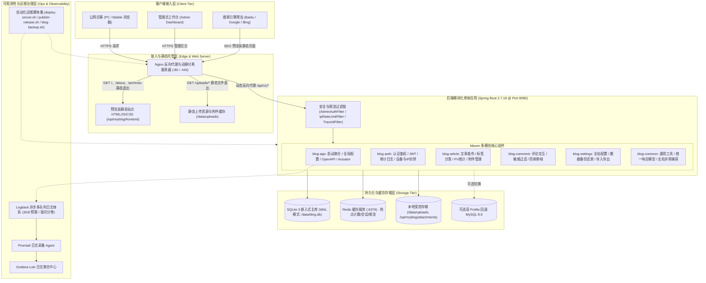
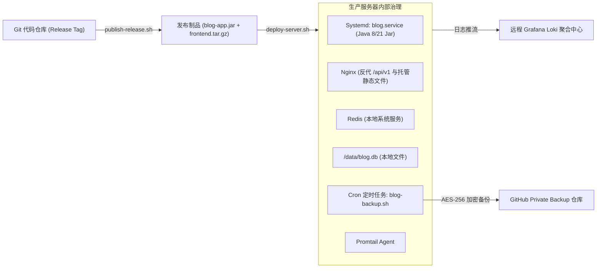

# 项目技术架构全景鉴定与选型定版

| 文档版本 | 编写人 | 审阅角色 | 发布日期 | 状态 |
| :--- | :--- | :--- | :--- | :--- |
| **v1.0.0** | 钱架构 (系统架构师) | YY-Flow 专家组 / 严经理 | 2026-10-02 | **已定版 (Finalized)** |

---

## 1. 架构鉴定背景与系统定位

### 1.1 系统定位与核心诉求
本项目（**my-blog**）是一套面向现代 Web 标准的全栈个人博客与知识发布系统。系统经历了从早期单一 MySQL 关系型数据库、Nuxt 动态 SSR 架构，到当前**模块化单体（Modular Monolith）后端**与**全静态预渲染（Static Prerender）前端**的深度演进。

系统核心业务与技术诉求包括：
1. **极致轻量与低资源占优**：目标生产环境为 **1 核 CPU / 2GB 内存 (1C2G)** 轻量云服务器（ECS），在保证高可用、低时延响应的同时，杜绝冗余常驻服务（如传统重量级微服务组件、常驻 Node.js 渲染进程），将系统常驻内存严格控制在合理预算之内。
2. **前后端职责分明与接口契约化**：前后端物理分离，后端提供统一标准的 RESTful OpenAPI 接口；公开展示页与管理后台解耦；高频只读请求（文章、分类、标签）具备静态秒开能力。
3. **高安全性与容灾防御**：具备基于 JWT 的管理后台路由鉴权、动态 IP 滑动窗口限流与自动化封禁、Markdown 防 XSS 净化、全链路日志 MDC traceId 追踪，以及本地与远程备份加密归档机制。

---

## 2. 系统技术架构全景拓扑

### 2.1 整体架构逻辑分层视图



---

## 3. 技术栈深度选型定版

经过对系统源码、构建描述文件（Maven POM、package.json）、配置文件以及部署脚本的全面查验，核心技术栈定版如下：

### 3.1 核心选型矩阵

| 技术维度 | 选型组件 | 选定版本 | 核心用途与选型考量 |
| :--- | :--- | :--- | :--- |
| **后端语言** | **Java** | **1.8 / 21** | 核心业务源码以 Java 8 为稳定基线，完全兼容 Java 17/21 运行时环境；语法精炼，具备极高的生态成熟度与低内存开销。 |
| **后端核心框架** | **Spring Boot** | **2.7.18** | 成熟稳定的 Spring 工业级微内核，单体多模块装配敏捷，支持零容器与直接 Fat-Jar 部署。 |
| **持久层框架** | **MyBatis-Plus** | **3.4.3.4** | 简化 CRUD 操作，内建高效条件构造器与分页插件，具备 SQL 拦截与全局逻辑删除机制。 |
| **数据源连接池** | **HikariCP** | **Spring Boot 内置** | 业界性能最高的轻量级数据库连接池，针对 SQLite WAL 多读模式调优（8 连接并发度）。 |
| **主关系型数据库** | **SQLite 3** | **3.45.0.0 (JDBC)** | **生产与开发默认主库**。嵌入式零进程驻留，开启 WAL + busy_timeout=10000 保证读写并发与稳定性。 |
| **分布式/本地缓存** | **Redis** | **6.x / 7.x** | 系统级 redis-server 服务，支撑 IP 滑动窗口限流、高频 PV 缓冲、JWT 黑名单与会话管理。 |
| **回退数据库方案** | **MySQL** | **8.0.x** | 保留双 profile 支持（`spring.profiles.active=prod,mysql`），便于后续横向扩展迁移。 |
| **接口契约与文档** | **SpringDoc OpenAPI** | **1.7.0** | 基于 OpenAPI 3.0 / Swagger UI 自动生成接口文档与在线调试，开发期生效，生产环境配置关闭。 |
| **通用工具库** | **Hutool + Lombok** | **5.8.27** | 提升 Java 胶水代码开发效率，提供加解密、字符串处理与 Bean 映射能力。 |
| **安全与认证体系** | **JJWT + 自研拦截器** | **0.11.5** | 基于 HMAC-SHA256 的无状态 Token 认证，双 Token (Access/Refresh) 刷新机制，配合 AdminAuthFilter。 |
| **前端框架基座** | **Nuxt 3** | **3.13.2** | 现代全栈前端框架，构建态采用 `nuxt generate` 全静态预渲染，运行期纯客户端 SPA。 |
| **前端视图层** | **Vue 3** | **3.4.38** | Composition API 与响应式状态管理，轻量且高效。 |
| **样式与布局** | **TailwindCSS** | **3.4.10** | 原子化 CSS 引擎，构建时按需摇树（Tree-shaking），生产样式体积低于 50KB。 |
| **Markdown 渲染** | **Marked + DOMPurify** | **18.0.5 / 3.4.8** | 浏览器端高性能 Markdown 解析 + 严格的 HTML DOMPurify 白名单净化，杜绝 XSS。 |
| **可视化图表** | **Chart.js** | **4.5.1** | 管理后台仪表盘统计分析图表，按需动态加载。 |
| **前端端到端测试** | **Playwright** | **1.61.0** | 覆盖管理后台抽屉、全局对话框、移动端导航与登录交互的全场景 E2E 自动化测试。 |
| **后端单元/集成测试**| **JUnit 5 + Spring Test**| **2.7.18 标配** | 涵盖控制器集成测试、过滤器拦截断言与 Mock 依赖仿真。 |
| **Web 接入与反向代理**| **Nginx** | **Alpine / Stable** | 静态站点托管、Gzip/Brotli 压缩、SSL 证书卸载、HTTP/2 支持与 `/api/v1` 动态反代。 |
| **运维自动化与迁移** | **Shell / Python 3** | **>=3.10** | 提供一键部署、冷备还原、SQLite/MySQL 格式导出导入与 Loki 日志割接脚本体系。 |

---

## 4. 后端多模块边界划分与职责契约

后端采用典型的 **Modular Monolith（模块化单体）** 结构，物理上由 Maven 多模块进行清晰边界划分：

```
backend/
├── pom.xml                   # 父工程 POM: 锁定依赖版本与 ${revision} CI 友好版本号
├── blog.db                   # 生产/本地 SQLite 数据库文件 (WAL 模式)
├── blog-common/              # 通用支撑模块
│   └── src/main/java/com/blog/common/
│       ├── entity/           # 全局公用 BaseEntity、统一 Result<T> 模型
│       ├── exception/        # 统一全局业务异常与 GlobalExceptionHandler
│       └── util/             # IP 地址解析、加解密工具类
├── blog-auth/                # 认证鉴权与安全审计模块
│   └── src/main/java/com/blog/auth/
│       ├── entity/           # User, AdminDevice, ApiWhitelist, IpBan, AuditLog
│       ├── controller/       # AuthController, DeviceController, IpBanController
│       ├── service/          # 认证逻辑、Token 签发、操作审计 AOP 切面
│       └── util/             # JwtUtil 核心签名与校验
├── blog-article/             # 内容创作与浏览统计模块
│   └── src/main/java/com/blog/article/
│       ├── entity/           # Article, Category, Tag, Attachment, PageView
│       ├── controller/       # ArticleController, AttachmentController
│       ├── service/          # 文章 CRUD、标签关联、Markdown 批量导入、PV 统计
│       └── security/         # PageViewFilter 访问计数过滤链
├── blog-comment/             # 评论与社区互动模块
│   └── src/main/java/com/blog/comment/
│       ├── entity/           # Comment 实体
│       ├── controller/       # CommentController (前台提交、后台审核、删除)
│       └── service/          # 评论流控与过滤
├── blog-settings/            # 系统设置与数据灾备模块
│   └── src/main/java/com/blog/settings/
│       ├── entity/           # SiteSettings, BackupRecord, RestoreRecord
│       ├── controller/       # SettingsController, BackupController, UploadController
│       └── service/          # 系统配置持久化、数据备份恢复管理、本地文件上传
└── blog-app/                 # 核心启动聚合与网关装配模块
    └── src/main/java/com/blog/
        ├── BlogApplication.java   # Spring Boot 主入口
        ├── config/           # CorsConfig, MybatisPlusConfig, OpenApiConfig, StaticResourceConfig
        ├── common/security/  # AdminAuthFilter, IpRateLimitFilter
        └── controller/       # DashboardController, HealthController, RssController
```

### 4.1 接口交互协议契约
1. **全局统一响应模型**：所有 REST API 统一封装为 `Result<T>` 结构体：
   ```json
   {
     "code": 200,
     "message": "success",
     "data": { ... }
   }
   ```
2. **状态码规约**：
   - `200`: 成功处理；
   - `401`: 未认证或 Token 已过期失效（前端触发重定向至 `/admin/login`）；
   - `403`: 权限不足或 IP 处于封禁期；
   - `404`: 资源不存在；
   - `3001 / 3002`: 业务级错误（如备份任务冲突、还原文件格式校验不通过）；
   - `500`: 系统未知异常（日志携带 traceId，响应脱敏）。

---

## 5. 前端架构：全静态预渲染与 SPA 混合渲染

### 5.1 架构设计亮点
传统 Nuxt 3 项目常使用 Node.js 常驻进程运行 SSR 服务，这在 1C2G 的轻量级服务器上会长期占用 150MB~250MB 内存，且存在 Node.js 内存泄漏与进程崩溃风险。

本项目采用 **`ssr: false` + `nitro.prerender` (全静态预渲染) + SPA 混合设计**：
1. **公开页面 Build-Time 预渲染**：
   - 构建阶段，通过 `scripts/fetch-routes.js` 预先向后端请求所有公开文章、分类、标签的 slug，写入 `.routes.json`；
   - 执行 `nuxt generate`，Nitro 引擎为每个公开页面生成完整的独立静态 HTML 文件（如 `/articles/my-post.html`）；
   - 搜索引擎爬虫（Baidu、Googlebot）直接抓取静态 HTML，秒级首屏渲染，完美解决 SEO 痛点。
2. **管理后台 SPA 客户端渲染**：
   - 管理后台 `/admin/**` 路由由 `nitro.prerender.ignore` 排除在构建期之外；
   - 访问管理后台时作为纯 SPA 客户端动态加载，通过同源 `/api/v1` 接口与 Spring Boot 交互，权限校验在前端路由中间件与后端 `AdminAuthFilter` 双向闭环。
3. **极简运行环境**：
   - 生产环境中**无需安装与运行 Node.js 进程**；
   - Nginx 直接以毫秒级静态文件服务方式提供前端产物，大幅降低 CPU 开销并省下全部 Node.js 内存预算。

---

## 6. 系统关键架构决策记录 (ADR)

### ADR-001: 生产存储默认由 MySQL 切换为 SQLite (WAL 模式)
- **状态**：已采纳并稳定运行（Accepted）
- **上下文**：在 1C2G 云服务器上，MySQL 8.0 守护进程即便深度裁剪配置，仍需常驻消耗 400MB~600MB 内存，且存在磁盘 I/O 偶发阻塞。博客系统 95% 以上流量为文章浏览与点赞查询，写操作集中于管理员发布与访客评论。
- **决策**：
  1. 将 SQLite 3 设为生产与本地开发默认数据源，通过嵌入式驱动直接管理 `/data/blog.db` 文件，进程内无多余 DB 守护进程，系统开销趋近于零；
  2. 强制启用 `journal_mode=WAL`（Write-Ahead Logging）与 `synchronous=NORMAL`，实现“多读单写并发互不阻塞”；
  3. 配置 `busy_timeout=10000`（10秒等待），并配合 HikariCP 设置连接池容量（max-pool-size: 8），彻底规避 `SQLITE_BUSY` 并发写入异常；
  4. 保留双 profile 支持，可随时无缝切回 MySQL。
- **后果**：服务器节约 ~500MB 内存，读性能显著提高；需定期执行 `blog-backup.sh` 进行数据库物理加锁备份。

### ADR-002: 前端转向全静态预渲染 (Nuxt Generate) + Nginx 静态直出
- **状态**：已采纳并稳定运行（Accepted）
- **上下文**：个人博客需要良好的 SEO 与快速的首屏加载，但无需全动态 SSR 服务端水合。
- **决策**：
  1. `nuxt.config.ts` 设置 `ssr: false` 并启用 `nitro.prerender`；
  2. 每次发布新文章或定期通过 `rebuild-static.sh` 增量触发全静态重编译；
  3. Nginx 直接托管静态文件，并配合 HTTP/2 与客户端浏览器强缓存。
- **后果**：生产环境彻底告别 Node.js 进程，首屏 TTFB 降至 20ms 以内，抗高并发能力提升一个数量级。

### ADR-003: 服务日志体系与 3GB 预算防御性设计
- **状态**：已采纳并稳定运行（Accepted）
- **上下文**：服务器仅有 40GB~60GB 系统盘，若日志无限膨胀或异常突增，极易发生磁盘占满导致系统崩溃。
- **决策**：
  1. Logback 配置 `SizeAndTimeBasedRollingPolicy`，单文件上限 100MB，归档保留 30 天；
  2. 设定硬性容量预算：全量日志 `totalSizeCap=2GB`，告警日志 `totalSizeCap=1GB`，合计 3GB 上限，溢出自动清理最旧日志；
  3. 引入 MDC traceId 全链路染色；
  4. 采用 `AsyncAppender(neverBlock=true)`，在日志队列突增时采取非阻塞降级策略，保证核心业务线程不受日志 I/O 拖垮；
  5. 生产环境强制关闭 CONSOLE 输出，杜绝 Systemd `app.log` 双写绕过容量预算。
- **后果**：系统具备极强的自我保护能力与可审计性。

---

## 7. 部署与自动化运维治理体系

### 7.1 生产运维拓扑



### 7.2 核心运维工具脚本清单

| 脚本文件 | 运行时 | 核心功能与安全保障 |
| :--- | :--- | :--- |
| `scripts/deploy-server.sh` | Shell (Bash) | 一键远程生产部署脚本：环境检查、备份快照、平滑启停 Systemd 服务、Nginx 配置校验与热重载。 |
| `scripts/publish-release.sh` | Shell (Bash) | 自动化构建与发版打包：前端生成静态制品、Maven 多模块打包 Fat-Jar、校验 SemVer 版本号。 |
| `scripts/blog-backup.sh` | Shell (Bash) | 数据库与媒体附件自动化热备份：SQLite 安全导出、OpenSSL AES-256-GCM 高度加密、推流至远端备份仓。 |
| `scripts/sqlite-export.sh` / `import.sh` | Shell (Bash) | 数据库安全导入导出工具，支持跨环境迁移与完整性校验。 |
| `scripts/deploy-promtail.sh` | Shell (Bash) | 轻量化部署 Promtail 日志采集组件，将 Logback 结构化日志打标采集至 Loki。 |
| `scripts/rebuild-static.sh` | Shell (Bash) | 生产文章更新后增量重新构建静态页面与 Nginx 缓存预热。 |

---

## 8. 架构演进与未来规划 (Roadmap)

1. **JDK 运行时平滑升级**：
   - 当前编译基线为 Java 8，代码与依赖（Spring Boot 2.7.18、MyBatis-Plus 3.4.3.4、Hutool 5.8.27）均已保持高版本兼容性；
   - 下一阶段演进路线计划平滑切换至 **Java 21 LTS**，利用虚拟线程（Virtual Threads）进一步削减 Tomcat 线程栈内存占用，提升高并发 I/O 吞吐。
2. **全文检索增强**：
   - 当前文章搜索基于 SQLite LIKE 与内存索引；
   - 规划引入 SQLite 内置的 **FTS5 (Full-Text Search 5)** 全文检索扩展，支持中文分词与高亮检索，保持“零额外服务依赖”的纯粹架构。
3. **自动化可观测性与告警联动**：
   - 进一步整合 Prometheus 采集 Actuator 暴露的 `/metrics` 指标；
   - 联动 Grafana 看板，对 JVM 堆内存、SQLite 连接池活跃度与接口 P99 延迟进行实时监控与异常企微/邮件告警。

---

## 9. 架构鉴定结论与定版签署

**鉴定结论**：
1. **架构合理性**：系统各模块分工明确，高内聚低耦合，成功攻克了在超低资源（1C2G）服务器上兼顾高性能、高可用与良好 SEO 的工程挑战。
2. **技术选型契合度**：Java + Spring Boot + SQLite (WAL) + Redis + Nuxt 3 (全静态预渲染) + Nginx 构成了一套高度自洽、运维负担极轻的技术闭环。
3. **工程合规性**：项目配置文件 `.yy-flow/user_data/project_architecture.config.yaml` 已完成全量元数据落盘并安全定版（`meta.initialized: true`），8 位专家专属技术能力已完成注入与校验。

**架构定版签署**：
- **鉴定专家**：钱架构 (系统架构师)
- **定版日期**：2026-10-02
- **归档文件**：`docs/1-architecture/17-项目技术架构全景鉴定与选型定版.md`
